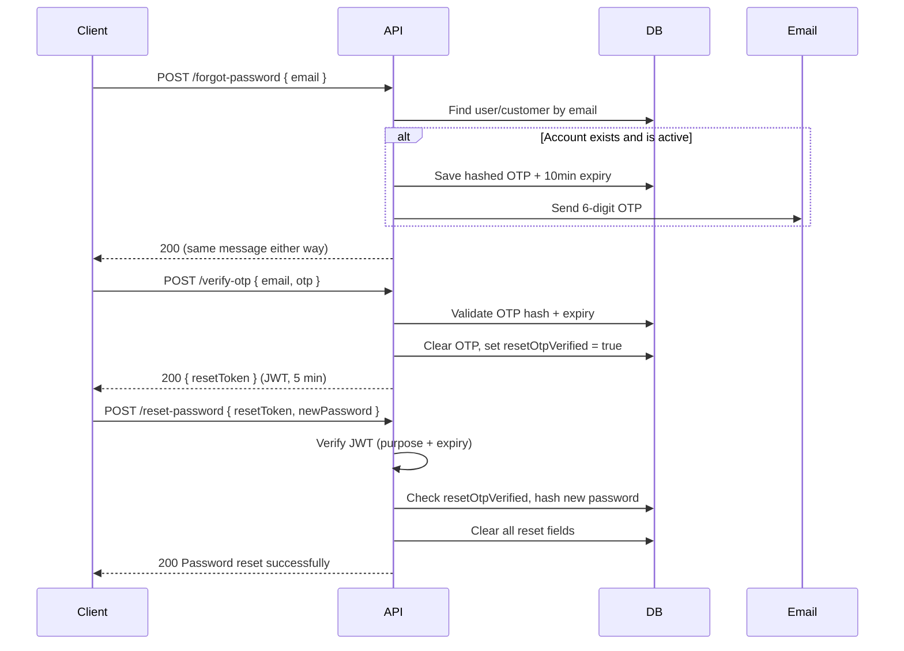

# Forgot Password API Flow

Password reset for users who are **logged out** and cannot remember their password. The flow uses a **3-step OTP pattern**:

1. Request OTP by email
2. Verify the 6-digit OTP → receive a short-lived reset token
3. Submit the new password with the reset token

This flow is implemented twice — once for **staff** (admin, sales, accounts, plant) and once for **customers**. The logic is the same; only the base path and underlying model differ.

> **Not this flow:** `POST /api/admin/employees/:userId/reset-password` is an admin-initiated password reset that emails a temporary password to an employee. That is separate from self-service forgot password.

---

## Endpoints

| Step | Staff panels | Customer portal |
|------|--------------|-----------------|
| 1 — Send OTP | `POST /api/auth/forgot-password` | `POST /api/customer/auth/forgot-password` |
| 2 — Verify OTP | `POST /api/auth/verify-otp` | `POST /api/customer/auth/verify-otp` |
| 3 — Reset password | `POST /api/auth/reset-password` | `POST /api/customer/auth/reset-password` |

**Auth required:** None on any of these three endpoints.

**Source files:**
- Staff: `src/controllers/auth.controller.js`, `src/routes/auth.routes.js`
- Customer: `src/controllers/customerAuth.controller.js`, `src/routes/customerAuth.routes.js`

---

## Flow diagram



---

## Response envelope

All endpoints use the standard API wrapper:

```json
{
  "success": true,
  "message": "...",
  "data": {}
}
```

Errors:

```json
{
  "success": false,
  "message": "...",
  "errors": []
}
```

The `errors` array is only present on validation failures (express-validator).

---

## Step 1 — Request OTP

Send a 6-digit OTP to the account email if it exists and is active.

### Staff

`POST /api/auth/forgot-password`

### Customer

`POST /api/customer/auth/forgot-password`

### Request body

| Field | Type | Required | Validation |
|-------|------|----------|------------|
| `email` | string | Yes | Valid email format |

```json
{
  "email": "user@company.com"
}
```

### Success response — `200`

```json
{
  "success": true,
  "message": "If that email exists, an OTP has been sent",
  "data": {}
}
```

### Server behavior

- Email is normalized: lowercased and trimmed.
- If no account exists **or** the account is inactive → still returns `200` with the same message (prevents email enumeration).
- If account exists and is active:
  - Generates a random 6-digit OTP.
  - Stores **bcrypt hash** of OTP on the record (`resetOtp`).
  - Sets `resetOtpExpiry` to **10 minutes** from now.
  - Sets `resetOtpVerified = false` (invalidates any prior verification).
  - Sends email via `sendOtp()` (SendGrid, subject: *"Your Password Reset OTP"*).

### Frontend guidance

Always show the user:

> *"If that email is registered, you'll receive a 6-digit code shortly."*

Do **not** change UI messaging based on whether the email exists.

### Validation errors — `400`

```json
{
  "success": false,
  "message": "Validation failed",
  "errors": [
    { "msg": "Invalid value", "path": "email", "location": "body" }
  ]
}
```

---

## Step 2 — Verify OTP

User enters the 6-digit code from email. On success, the server returns a short-lived JWT used in Step 3.

### Staff

`POST /api/auth/verify-otp`

### Customer

`POST /api/customer/auth/verify-otp`

### Request body

| Field | Type | Required | Validation |
|-------|------|----------|------------|
| `email` | string | Yes | Valid email |
| `otp` | string | Yes | Exactly 6 numeric digits |

```json
{
  "email": "user@company.com",
  "otp": "483920"
}
```

### Success response — `200`

```json
{
  "success": true,
  "message": "OTP verified successfully",
  "data": {
    "resetToken": "eyJhbGciOiJIUzI1NiIsInR5cCI6IkpXVCJ9..."
  }
}
```

### Server behavior

1. Looks up account by email.
2. Requires `resetOtp` and `resetOtpExpiry` to be set (from Step 1).
3. Rejects if current time is past `resetOtpExpiry`.
4. Compares submitted OTP to stored bcrypt hash.
5. On match:
   - Clears `resetOtp` and `resetOtpExpiry` (OTP is **single-use**).
   - Sets `resetOtpVerified = true`.
   - Issues JWT signed with `JWT_RESET_SECRET`, expiry **5 minutes**.
     - Staff payload: `{ _id, purpose: 'password-reset' }`
     - Customer payload: `{ _id, purpose: 'password-reset', type: 'customer' }`

### Error responses

| Status | Message | When |
|--------|---------|------|
| `400` | `Invalid or expired OTP` | Unknown email, or no OTP was requested |
| `400` | `OTP has expired. Please request a new one` | Past 10-minute window — restart from Step 1 |
| `400` | `Invalid OTP` | Wrong code |
| `401` | `Account is deactivated` | Staff only — inactive user |
| `400` | `Validation failed` | Invalid email or OTP format |

### Frontend guidance

- Store `resetToken` in **memory only** (React state / session), not `localStorage`.
- Proceed to the new-password screen immediately; the token expires in 5 minutes.

### Development only — master OTP

When `NODE_ENV !== 'production'` and `MASTER_OTP` is set in env, that value bypasses OTP hash comparison. Useful for local/staging testing without reading email.

---

## Step 3 — Reset password

Set a new password using the reset token from Step 2.

### Staff

`POST /api/auth/reset-password`

### Customer

`POST /api/customer/auth/reset-password`

### Request body

| Field | Type | Required | Validation |
|-------|------|----------|------------|
| `resetToken` | string | Yes | Non-empty JWT from Step 2 |
| `newPassword` | string | Yes | Minimum 6 characters |

```json
{
  "resetToken": "eyJhbGciOiJIUzI1NiIsInR5cCI6IkpXVCJ9...",
  "newPassword": "NewPass@456"
}
```

### Success response — `200`

```json
{
  "success": true,
  "message": "Password reset successfully",
  "data": {}
}
```

### Server behavior

1. Verifies JWT signature and expiry using `JWT_RESET_SECRET`.
2. Validates JWT claims:
   - Staff: `purpose === 'password-reset'`
   - Customer: `purpose === 'password-reset'` **and** `type === 'customer'`
3. Loads account by `_id` from token.
4. Requires `resetOtpVerified === true` (proves Step 2 completed).
5. Staff only: rejects if account is inactive (`401`).
6. Hashes `newPassword` with bcrypt (cost 12).
7. Sets `passwordChangedAt = now`.
8. Clears `resetOtp`, `resetOtpExpiry`, and `resetOtpVerified`.

Redirect the user to login after success.

### Error responses

| Status | Message | When |
|--------|---------|------|
| `400` | `Invalid or expired reset token` | JWT expired (5 min), invalid signature, or wrong claims |
| `400` | `Invalid reset token` | Wrong `purpose` or missing `type: 'customer'` on customer flow |
| `400` | `OTP not verified. Please start over` | Step 2 was skipped or state was cleared |
| `401` | `Account is deactivated` | Staff only |
| `400` | `Validation failed` | Missing token or password too short |

---

## Why the reset token?

Step 3 does not accept email + OTP directly. The reset token is cryptographic proof that Step 2 succeeded. Without it, anyone who knows an email could attempt to set a new password without verifying inbox access.

Two layers of expiry:

| Artifact | TTL | On expiry |
|----------|-----|-----------|
| OTP (email code) | 10 minutes | Call Step 1 again |
| Reset token (JWT) | 5 minutes | Restart entire flow from Step 1 |

---

## Database fields

Both `User` (staff) and `Customer` models store the same reset state:

| Field | Type | Purpose |
|-------|------|---------|
| `resetOtp` | String (hashed) | Bcrypt hash of the 6-digit OTP |
| `resetOtpExpiry` | Date | When the OTP expires |
| `resetOtpVerified` | Boolean | `true` after Step 2; required for Step 3 |
| `passwordChangedAt` | Date | Updated when password is reset or changed |

---

## Email

OTP emails are sent through SendGrid (`src/services/email/mailer.js` → `sendOtp()`).

| Property | Value |
|----------|-------|
| Template | `src/services/email/templates/otp.html` |
| Subject | `Your Password Reset OTP` |
| Placeholders | `NAME`, `OTP`, `EXPIRES_IN` (minutes) |

Requires `SENDGRID_API_KEY` and `MAIL_FROM` (or `SENDGRID_FROM`) to be configured.

---

## Environment variables

| Variable | Used for |
|----------|----------|
| `JWT_RESET_SECRET` | Signing reset tokens (falls back to `JWT_ACCESS_SECRET` if unset) |
| `SENDGRID_API_KEY` | Sending OTP email |
| `MAIL_FROM` / `SENDGRID_FROM` | From address on OTP email |
| `MASTER_OTP` | Dev/staging bypass OTP (non-production only) |

---

## Frontend integration checklist

1. **Forgot password screen** → `POST .../forgot-password` with email.
2. **OTP entry screen** → `POST .../verify-otp` with email + 6-digit code.
3. **New password screen** → `POST .../reset-password` with `resetToken` + `newPassword`.
4. Keep `resetToken` in component/session state between Steps 2 and 3.
5. On OTP expiry error → return user to Step 1.
6. On reset token expiry error → return user to Step 1 (full restart).
7. After success → navigate to login; do not auto-login (no tokens are issued by reset).
8. Use the correct base path for the panel (`/api/auth` vs `/api/customer/auth`).

---

## Example cURL sequence (staff)

```bash
# Step 1
curl -X POST http://localhost:5000/api/auth/forgot-password \
  -H "Content-Type: application/json" \
  -d '{"email":"admin@company.com"}'

# Step 2
curl -X POST http://localhost:5000/api/auth/verify-otp \
  -H "Content-Type: application/json" \
  -d '{"email":"admin@company.com","otp":"483920"}'

# Step 3
curl -X POST http://localhost:5000/api/auth/reset-password \
  -H "Content-Type: application/json" \
  -d '{"resetToken":"<token from step 2>","newPassword":"NewPass@456"}'
```

Replace `/api/auth` with `/api/customer/auth` for the customer portal.

---

## Related documentation

- [PASSWORD FLOW.md](./PASSWORD%20FLOW.md) — includes logged-in **change password** flow (`PUT .../change-password`)
- Postman collections: `postman_collection.json`, `customer-app.postman_collection.json`
