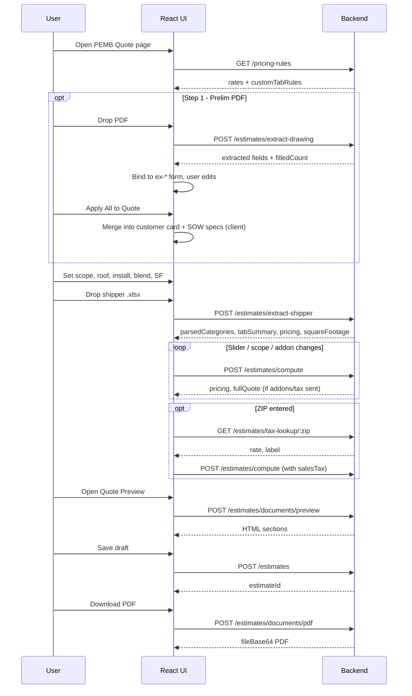
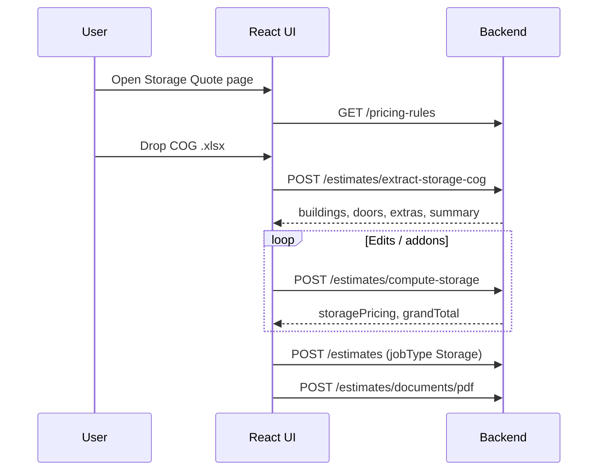

# Quoting Tool — React Frontend Integration Flow

Handoff for the React clone of `SM-QuotingTool-v5 (31).html`.  
**All parsing, pricing, tax, and document generation run on the backend.** React owns UI state, form binding, and rendering API responses.

**Production base URL:** `https://mr-storage-backend-025k.onrender.com`  
**Sales API prefix:** `/api/sales`  
**Admin API prefix:** `/api/admin` (same estimate routes, admin sees all quotes)

**Auth:** Every request needs `Authorization: Bearer <accessToken>` from `POST /api/auth/login`.

**Detailed endpoint payloads:** see [`ai-quoting-tool-api.md`](./ai-quoting-tool-api.md)

---

## Architecture split

| Layer | Responsibility |
|-------|------------------|
| **React UI** | Pages, forms, file pickers, tables, sliders, SOW/contract display, local draft state |
| **Backend API** | PDF extract, shipper/COG parse, pricing engine, tax lookup, HTML/PDF documents, save/load |
| **Not on backend yet** | AI SOW rewrite (HTML called Anthropic directly in-browser — keep client-side or add later) |
| **Client-only** | “Apply extracted fields to quote” merge logic, customer message line on shipper upload, print CSS |

---

## React pages ↔ HTML tool

| React route / page | HTML `page-*` | Primary APIs |
|--------------------|---------------|--------------|
| PEMB Quote | `page-quote` | extract-drawing, extract-shipper, compute, tax-lookup |
| Storage Quote | `page-storage-cog` | extract-storage-cog, compute-storage, tax-lookup |
| Quote Preview | `page-assemble` | documents/preview, documents/pdf |
| Quote Library | `page-history` | GET estimates, GET estimates/:id, DELETE |
| Pricing Rules | `page-pricing` | GET/PUT pricing-rules |
| Custom Quote | `page-custom` | Manual — optional POST estimates (no auto-parse) |

---

## Shared setup (every session)

### 1. Login (once)

```
POST /api/auth/login
{ "email": "...", "password": "..." }
→ store data.accessToken
```

### 2. Load pricing rules (app init or Pricing Rules page)

```
GET /api/sales/pricing-rules
→ store in React context / Redux (steel rates, freight, install tiers, customTabRules)
```

Custom rules are **automatically applied** when calling `extract-shipper` — you do not need to send them again unless you changed rules mid-session (then re-upload shipper or rely on rules loaded server-side per user).

---

## Flow A — PEMB Quote (main path)

This mirrors HTML **Step 1 (prelim PDF)** → **Step 2 (shipper XLSX)** → **tabs/pricing** → **Quote Preview**.



### Step-by-step (PEMB)

#### A0 — Page mount

| Order | API | When | Store in state |
|-------|-----|------|----------------|
| 1 | `GET /api/sales/pricing-rules` | Page load | `pricingRules` |

#### A1 — Upload prelim drawing (optional)

| Order | API | When | Request |
|-------|-----|------|---------|
| 2 | `POST /api/sales/estimates/extract-drawing` | User selects PDF | `{ fileBase64, fileName }` |

**Response → UI mapping**

| API `data.extracted` key | React field (HTML id) |
|--------------------------|----------------------|
| `customer` | `ex-customer` |
| `project` | `ex-project` |
| `jobnumber` | `ex-jobnumber` |
| `location` | `ex-location` |
| `date` | `ex-date` |
| `width`, `length`, `eave`, `sqft`, `bay`, `slope` | dimension inputs |
| `dead`, `collateral`, `live`, `roofsnow`, `snow`, `wind`, `exposure`, `snowexp`, `ipc` | load inputs |
| `risk`, `siteclass`, `seismiccat`, `seismiczone`, `seismic`, `sd1`, `s1`, `thermal`, `code` | seismic/code inputs |
| `windif`, `snowif`, `shearlong`, `sheartrans`, `deflcol` | importance/shear inputs |
| `frame`, `roofpanel`, `wall`, `notes` | panel/frame inputs |

**UI behavior**

- Show `filledCount` in status (e.g. “12 fields extracted”).
- If `filledCount === 0`, show `rawTextPreview` and amber “manual entry” state (same as HTML).
- **“Apply All to Quote & SOW”** — pure client merge into `customer-name`, `building-size`, `building-sf`, `job-location`, and SOW spec object (no API call).

#### A2 — Upload shipper Excel (required for PEMB pricing)

| Order | API | When | Request |
|-------|-----|------|---------|
| 3 | `POST /api/sales/estimates/extract-shipper` | User drops `.xlsx` | See below |

```json
{
  "fileBase64": "<base64>",
  "fileName": "shipper.xlsx",
  "jobType": "PEMB",
  "scope": "both",
  "roof": "screw-down",
  "install": "medium",
  "squareFootage": 0,
  "sf": 0,
  "useManualSquareFootage": false,
  "blendPct": 50,
  "installCostPerSf": 5.5,
  "sellPerSf": 8.5
}
```

**Important:** always send `squareFootage: 0` on a **fresh shipper upload** so the backend derives SF from `totalWeightLbs ÷ 9`. Do not forward stale SF from a prior quote or PDF extract unless the user explicitly locked it.

**Persist these from response** (needed for re-compute and save):

```javascript
{
  parsedCategories: data.parsedCategories,
  tabSummary: data.tabSummary,
  pricingResult: data.pricing,      // rename for save model
  weightByCategory: data.weightByCategory,
  squareFootage: data.squareFootage,
  totalWeightLbs: data.totalWeightLbs,
  sourceFileName: data.fileName,
  coverSheet: data.coverSheet         // optional — fill customer fields
}
```

**Render pricing table** from `data.pricing.rows` (same columns as HTML: category, weight, rate, price).

Backend returns `squareFootage` from weight ÷ 9 when `useManualSquareFootage` is false. Update SF input with `data.squareFootage`.

**Example baseline** (`shipper_excel_quote_example.xlsx`): 13,547 lbs parsed · 1,505 SF · 10 pricing rows · includes Rigid Frames & Angles.

Tab names like `"1. STUDS & TOP CHANNELS"` and `"6. ANGLES"` are handled server-side (numeric prefix stripped before category match).

#### A3 — User changes controls (no re-upload)

Call **`POST /api/sales/estimates/compute`** when any of these change:

- Scope: `supply` | `install` | `both` (lowercase)
- `squareFootage`, `blendPct`, `roof`, `install` tier
- Concrete / insulation toggles and values
- Sales tax rate
- COGS or margin override (applied)

```json
{
  "parsedCategories": { "...from step A2..." },
  "jobType": "PEMB",
  "scope": "both",
  "squareFootage": 1505,
  "useManualSquareFootage": true,
  "blendPct": 50,
  "roof": "screw-down",
  "install": "medium",
  "installCostPerSf": 5.5,
  "sellPerSf": 8.5,
  "concrete": { "include": true, "costSF": 7.25, "marginPct": 25 },
  "insulation": { "include": false },
  "salesTax": { "rate": 7, "include": true },
  "cogsOverride": { "applied": false },
  "marginOverride": { "applied": false }
}
```

Response: `{ weightByCategory, pricing, fullQuote }` — replace table and grand total.

#### A4 — Tax lookup (when user enters ZIP)

| Order | API | When |
|-------|-----|------|
| 4a | `GET /api/sales/estimates/tax-lookup/51503` | User blurs ZIP field |
| 4b | `POST /api/sales/estimates/compute` | Include `salesTax: { rate, include: true }` |

#### A5 — COGS / Margin panels (optional preview)

| API | Purpose |
|-----|---------|
| `POST /api/sales/estimates/cogs/preview` | Live preview before applying |
| `POST /api/sales/estimates/margin/preview` | Live preview before applying |

To **apply**, send the same override with `"applied": true` on the next `/compute` call.

#### A6 — Quote Preview page

| Order | API | When |
|-------|-----|------|
| 5 | `POST /api/sales/estimates/documents/preview` | User opens Preview tab |

```json
{
  "leadCompanyName": "ABC Storage",
  "squareFootage": 1505,
  "pricingResult": { "...from compute..." },
  "fullQuote": { "...from compute..." },
  "extractedDrawingFields": { "...from PDF step..." },
  "contractDetails": { "...form fields..." },
  "drawingAttachments": [],
  "sections": ["quote", "sow", "contract", "drawings"]
}
```

Render returned HTML in iframes or `dangerouslySetInnerHTML` per section.

#### A7 — Save draft

| Order | API | When |
|-------|-----|------|
| 6 | `POST /api/sales/estimates` | First save |
| 7 | `PUT /api/sales/estimates/:estimateId` | Subsequent saves |

Minimum PEMB save body:

```json
{
  "leadId": "optional-mongo-id",
  "jobType": "PEMB",
  "scope": "both",
  "leadCompanyName": "ABC Storage",
  "customerEmail": "john@example.com",
  "buildingSize": "200x250x36",
  "squareFootage": 1505,
  "sourceFileName": "shipper.xlsx",
  "extractedDrawingFields": { "width": "90'", "wind": "110 mph" },
  "parsedCategories": { "...from extract-shipper..." },
  "tabSummary": [ "..." ],
  "pricingResult": { "...from compute..." },
  "fullQuoteResult": { "...from compute..." },
  "concreteAddon": { "...if used..." },
  "insulationAddon": { "...if used..." },
  "salesTax": { "rate": 7, "include": true },
  "status": "draft"
}
```

#### A8 — Export PDF

```
POST /api/sales/estimates/documents/pdf
(same body as preview)
→ { fileName, mimeType, fileBase64 }
→ trigger browser download
```

Or after save:

```
POST /api/sales/estimates/:estimateId/documents/pdf
{ "sections": ["quote", "sow", "contract"] }
```

---

## Flow B — Storage COG Quote



| Step | API | Notes |
|------|-----|-------|
| 1 | `GET /pricing-rules` | Storage markup multiplier |
| 2 | `POST /estimates/extract-storage-cog` | `{ fileBase64, fileName }` + optional concrete/insulation/tax |
| 3 | `POST /estimates/compute-storage` | On any building/door/extra/install edit |
| 4 | `GET /estimates/tax-lookup/:zip` | Same as PEMB |
| 5 | `POST /estimates` | `jobType: "Storage"`, `storageData: { buildings, doors, extras, ... }` |
| 6 | `documents/preview` or `documents/pdf` | Same pattern as PEMB |

---

## Flow C — Quote Library (reload saved quote)

| Action | API |
|--------|-----|
| List quotes | `GET /api/sales/estimates?page=1&limit=20` |
| Dashboard stats | `GET /api/sales/estimates/history/summary` |
| Open quote | `GET /api/sales/estimates/:estimateId` |
| Delete | `DELETE /api/sales/estimates/:estimateId` |

**Reload behavior:** Hydrate React state from saved document — `parsedCategories`, `pricingResult`, `extractedDrawingFields`, `storageData`, etc. User can re-run `/compute` without re-uploading files if categories are persisted.

---

## Flow D — Pricing Rules page

| Action | API |
|--------|-----|
| Load | `GET /api/sales/pricing-rules` |
| Save | `PUT /api/sales/pricing-rules` |

After saving new `customTabRules`, tell user to **re-upload shipper** (or call `extract-shipper` again) for custom part rules to affect line items.

---

## Recommended React state shape

```typescript
type QuoteSession = {
  // Customer card
  customer: {
    name: string
    email: string
    address: string
    location: string
    buildingSize: string
    squareFootage: number
    jobNumber: string
    date: string
  }

  // Prelim PDF
  extractedDrawing: Record<string, string>
  prelimFileName: string | null

  // Shipper / pricing (PEMB)
  parsedCategories: object | null
  tabSummary: array | null
  pricingResult: object | null
  fullQuoteResult: object | null
  sourceFileName: string | null

  // Storage
  storageData: object | null
  storagePricingResult: object | null

  // Options (send on every compute)
  jobType: 'PEMB' | 'Storage'
  scope: 'supply' | 'install' | 'both'
  roof: 'screw-down' | 'standing-seam'
  install: 'easy' | 'medium' | 'hard'
  blendPct: number
  concrete: object | null
  insulation: object | null
  salesTax: { rate: number; include: boolean }
  cogsOverride: object | null
  marginOverride: object | null

  // Persisted
  estimateId: string | null
  pricingRules: object | null
}
```

---

## File upload helper (use everywhere)

```javascript
export async function fileToBase64(file) {
  const buf = await file.arrayBuffer()
  const bytes = new Uint8Array(buf)
  let binary = ''
  for (let i = 0; i < bytes.length; i++) binary += String.fromCharCode(bytes[i])
  return btoa(binary)
}

export async function apiPost(path, body, token) {
  const res = await fetch(`${API_BASE}${path}`, {
    method: 'POST',
    headers: {
      'Content-Type': 'application/json',
      Authorization: `Bearer ${token}`,
    },
    body: JSON.stringify(body),
  })
  const json = await res.json()
  if (!json.success) throw new Error(json.message || 'API error')
  return json.data
}
```

---

## API call order cheat sheet

### PEMB — minimum happy path

1. `GET /pricing-rules`
2. `POST /estimates/extract-drawing` *(optional)*
3. `POST /estimates/extract-shipper`
4. `POST /estimates/compute` *(on each control change)*
5. `GET /estimates/tax-lookup/:zip` *(optional)*
6. `POST /estimates/documents/preview` *(preview page)*
7. `POST /estimates` *(save)*
8. `POST /estimates/documents/pdf`

### Storage — minimum happy path

1. `GET /pricing-rules`
2. `POST /estimates/extract-storage-cog`
3. `POST /estimates/compute-storage` *(on edits)*
4. `POST /estimates` *(save)*
5. `POST /estimates/documents/pdf`

---

## Common mistakes to avoid

| Mistake | Fix |
|---------|-----|
| Calling old shipper endpoint expecting `tabs[]` with empty weights | Use new shape: `parsedCategories`, `pricing.rows`, `totalWeightLbs` |
| Re-uploading shipper on every slider change | Keep `parsedCategories` in state; call `/compute` only |
| Scope as `Both` (capital B) | Use lowercase `both` |
| Forgetting JWT on sales routes | 401 without token |
| Expecting backend to merge PDF fields into customer card | “Apply All” is client-side merge |
| Using `/api/quotations` for this tool | Wrong model — use `/api/sales/estimates` (`EstimateQuote`) |

---

## What is NOT wired to backend yet

| HTML feature | Status |
|--------------|--------|
| AI SOW edit (“Describe a change…”) | Client-side only in HTML |
| Email/send quote from tool | Use separate `/api/quotations` workflow or build later |
| localStorage quote history | Replace with `GET/POST /estimates` |

---

## Related docs

- [`ai-quoting-tool-api.md`](./ai-quoting-tool-api.md) — full request/response schemas
- Example files in repo root: `pdf_quote_example.pdf`, `shipper_excel_quote_example.xlsx`
