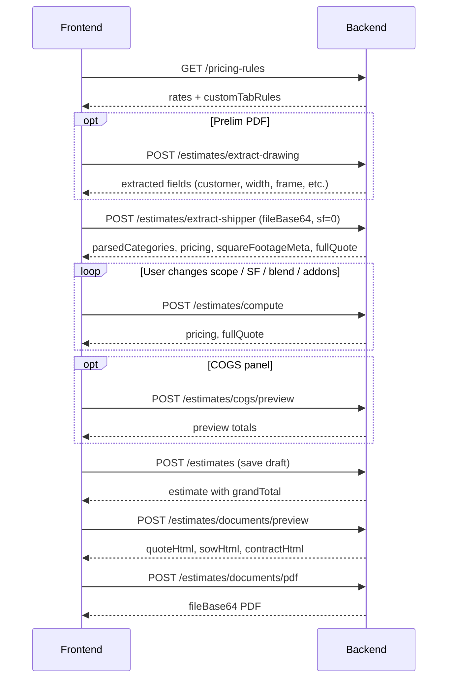
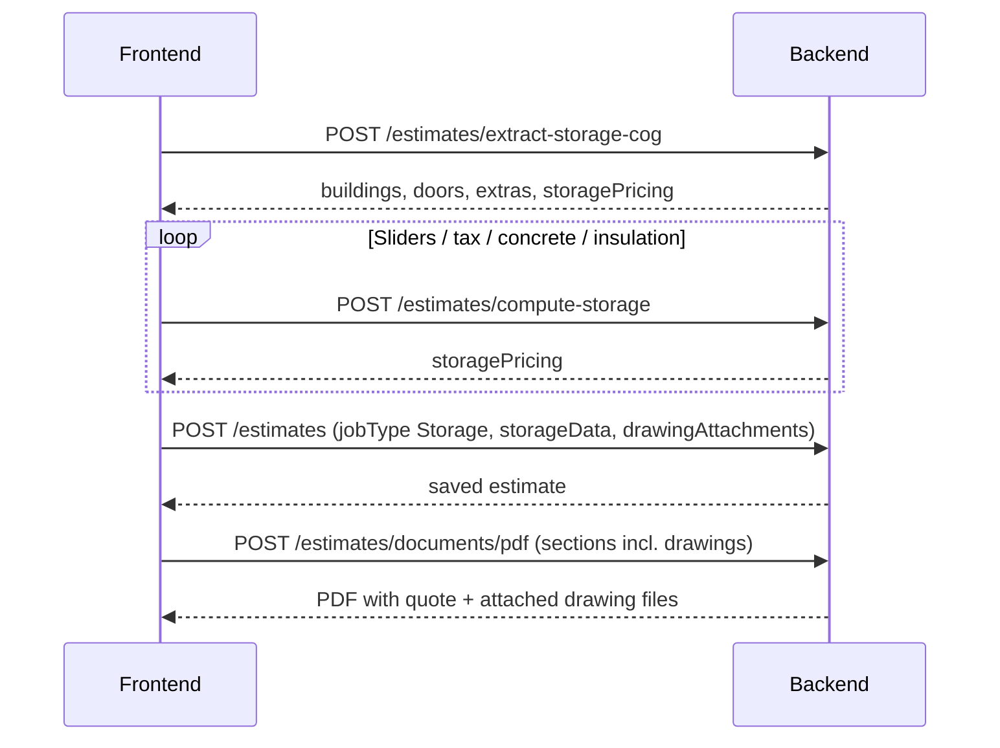

# Sales Quotation API — Full Reference

**Date:** August 28, 2026  
**Audience:** Frontend / integration developers  
**Production base URL:** `https://mr-storage-backend-025k.onrender.com`  
**Deploy branch:** `shubham-changes-13-aug`  
**Reference UI:** `SM-QuotingTool-API.html` (repo root)

This document describes the **AI Quoting Tool** API used by sales to build PEMB and Storage quotes from shipper/COG files, pricing rules, and optional drawing PDFs. It is distinct from the legacy manual **`/api/sales/quotations`** proposal workflow (see [§16](#16-separate-from-manual-quotations)).

---

## Table of contents

1. [Overview](#1-overview)
2. [Authentication](#2-authentication)
3. [Response envelope](#3-response-envelope)
4. [End-to-end flows](#4-end-to-end-flows)
5. [Pricing rules](#5-pricing-rules)
6. [PEMB — extract drawing PDF](#6-pemb--extract-drawing-pdf)
7. [PEMB — extract shipper XLSX](#7-pemb--extract-shipper-xlsx)
8. [PEMB — compute pricing](#8-pemb--compute-pricing)
9. [Storage — extract COG sheet](#9-storage--extract-cog-sheet)
10. [Storage — compute pricing](#10-storage--compute-pricing)
11. [COGS & margin preview](#11-cogs--margin-preview)
12. [Sales tax lookup](#12-sales-tax-lookup)
13. [Documents — preview & PDF](#13-documents--preview--pdf)
14. [Estimates CRUD & history](#14-estimates-crud--history)
15. [Shared payload shapes](#15-shared-payload-shapes)
16. [Separate from manual quotations](#16-separate-from-manual-quotations)
17. [Frontend checklist](#17-frontend-checklist)

---

## 1. Overview

### API prefixes

| Prefix | Purpose |
|--------|---------|
| `/api/auth` | Login (get JWT) |
| `/api/sales/pricing-rules` | Per-user steel rates, freight, markup, custom tab rules |
| `/api/sales/estimates` | Quoting tool — parse files, compute, save, PDF |

All `/api/sales/*` quoting routes require **`Authorization: Bearer <accessToken>`** and role **`sales`** (admin can use `/api/admin/estimates` with same handlers).

### Job types

| `jobType` | Source file | Primary compute endpoint |
|-----------|-------------|--------------------------|
| `PEMB` | Xshipper `.xlsx` | `extract-shipper` → `compute` |
| `Storage` | COG `.xls` / `.xlsx` | `extract-storage-cog` → `compute-storage` |

### Recommended defaults (aligned with v5 HTML tool)

| Setting | Value |
|---------|-------|
| PEMB `scope` | `supply` |
| PEMB `install` | `easy` |
| Shipper SF on upload | `squareFootage: 0`, `useManualSquareFootage: false` |
| Storage building markup | **25%** |
| Storage shipping default | **$12,000** |
| Storage install sell / cost | **$3.25 / $2.50** per SF |
| Vendor blend | **50%** Quicken |

---

## 2. Authentication

### `POST /api/auth/login`

No auth header required.

**Request**

```json
{
  "email": "sales1@example.com",
  "password": "sales@1234"
}
```

**Response `200`**

```json
{
  "success": true,
  "message": "Success",
  "data": {
    "accessToken": "eyJhbGciOiJIUzI1NiIsInR5cCI6IkpXVCJ9...",
    "refreshToken": "eyJhbGciOiJIUzI1NiIsInR5cCI6IkpXVCJ9...",
    "user": {
      "_id": "69e61375e2dc3d6e7468ca3d",
      "email": "sales1@example.com",
      "role": "sales",
      "name": "Sales One"
    }
  }
}
```

Use **`data.accessToken`** on all subsequent requests (not `token`).

**All quoting requests**

```
Authorization: Bearer <accessToken>
Content-Type: application/json
```

---

## 3. Response envelope

**Success**

```json
{
  "success": true,
  "message": "Success",
  "data": { }
}
```

**Error**

```json
{
  "success": false,
  "message": "parsedCategories required"
}
```

Common HTTP codes: `400` validation, `401` missing/invalid token, `403` access denied, `404` not found, `500` server error.

---

## 4. End-to-end flows

### 4.1 PEMB quote flow



### 4.2 Storage COG flow



### 4.3 State to persist client-side between calls

| After step | Keep in client state |
|------------|----------------------|
| `extract-shipper` | `parsedCategories`, `tabSummary`, `pricing`, `squareFootage`, `squareFootageMeta`, `coverSheet` |
| `extract-storage-cog` | `storageData` (buildings, doors, extras), `storagePricing` |
| `compute` / slider change | Updated `pricing`, `fullQuote` |
| `extract-drawing` | `extractedDrawingFields` for form prefill |
| Save | `estimateId` from `POST /estimates` |

---

## 5. Pricing rules

Per-user document. Custom tab rules are **automatically applied** on `extract-shipper` — do not re-send rules in the upload body.

### `GET /api/sales/pricing-rules`

**Response**

```json
{
  "success": true,
  "data": {
    "pricingRules": {
      "_id": "...",
      "ownerId": "...",
      "steelRatesPerLb": {
        "primaryFrames": 1.71,
        "secondarySteel": 0.88,
        "hssBeams": 2.05,
        "angles": 1.04,
        "openingsJambs": 1.2,
        "platesClips": 1.2
      },
      "sheetingRatesPerSf": {
        "standardScrewDown": 1.30,
        "standingSeam": 1.70
      },
      "freight": {
        "ratePerLb": 0.13,
        "lbsPerTruck": 40000,
        "accessoriesAllowancePerSf": 0.10,
        "vendorDeltaPerLb": 0.10
      },
      "markup": {
        "pembMultiplier": 1.30,
        "storageMultiplier": 1.18
      },
      "install": {
        "pembEasy": { "cost": 5.5, "sell": 8.5 },
        "pembMedium": { "cost": 5.75, "sell": 9.0 },
        "pembHard": { "cost": 6.25, "sell": 9.25 },
        "pembTallHard": { "cost": 7.0, "sell": 11.0 }
      },
      "customTabRules": [
        {
          "matchType": "part_number",
          "match": "DK6",
          "cat": "trim",
          "method": "per_lf",
          "rate": 0.85,
          "note": "Jamb trim"
        }
      ]
    }
  }
}
```

### `PUT /api/sales/pricing-rules`

Send any subset of top-level keys to update.

**Request**

```json
{
  "steelRatesPerLb": { "primaryFrames": 1.71 },
  "markup": { "pembMultiplier": 1.30 },
  "customTabRules": []
}
```

**Response:** `{ "pricingRules": { ... } }`

| Custom rule field | Values |
|-------------------|--------|
| `matchType` | `tab_name` \| `part_number` \| `description` |
| `method` | `per_lb` \| `per_lf` \| `per_sf` \| `flat_each` \| `flat_total` |
| `cat` | `primary` \| `secondary` \| `opening` \| `sheeting` \| `angle` \| `plate` \| `trim` \| `misc` \| `accessories` \| `fasteners` \| `hss` |

**Note:** `pembMultiplier: 1.30` = **30% markup on cost** ≈ **23.1% gross margin on sell** (not 30% margin).

---

## 6. PEMB — extract drawing PDF

### `POST /api/sales/estimates/extract-drawing`

Optional step. Extracts page-1 text from prelim/engineering PDFs.

**Request**

```json
{
  "fileBase64": "<base64 PDF>",
  "fileName": "prelim.pdf"
}
```

**Response**

```json
{
  "success": true,
  "data": {
    "fileName": "prelim.pdf",
    "textItemCount": 842,
    "filledCount": 12,
    "extracted": {
      "customer": "ABC Storage LLC",
      "project": "Paris TN Expansion",
      "jobnumber": "6959",
      "width": "20'",
      "length": "150'",
      "eave": "16'",
      "sqft": "3000",
      "frame": "Clear Span Rigid Frame",
      "wind": "110 mph",
      "snow": "20 psf",
      "dead": "2.50 psf",
      "code": "IBC 2021",
      "roofpanel": "26 GA R-Loc",
      "wall": "26 GA R-Loc"
    },
    "rawTextPreview": "...(line-by-line page 1 text)...",
    "note": "Best-effort extraction — review before applying."
  }
}
```

| Field | Notes |
|-------|-------|
| `extracted.frame` | Building frame type when detected |
| `filledCount: 0` | Image-only PDF — show raw text + manual entry |

---

## 7. PEMB — extract shipper XLSX

### `POST /api/sales/estimates/extract-shipper`

Parses material tabs, runs pricing engine, returns breakdown + optional `fullQuote`.

**Request**

```json
{
  "fileBase64": "<base64 xlsx>",
  "fileName": "#6959 Paris, TN expansion (Shipper).xlsx",
  "jobType": "PEMB",
  "scope": "supply",
  "roof": "screw-down",
  "install": "easy",
  "squareFootage": 0,
  "sf": 0,
  "useManualSquareFootage": false,
  "blendPct": 50,
  "installCostPerSf": 5.5,
  "sellPerSf": 8.5,
  "concrete": { "include": false },
  "insulation": { "include": false },
  "salesTax": { "rate": 0, "include": true }
}
```

| Field | Default | Notes |
|-------|---------|-------|
| `scope` | `both` if omitted | Use `supply` \| `install` \| `both` (lowercase) |
| `squareFootage` / `sf` | `0` on upload | Backend derives SF from weight unless manual lock |
| `useManualSquareFootage` | `false` | Set `true` when user typed SF |
| `blendPct` | `50` | Quicken/Central vendor blend 0–100 |
| `install` | `medium` if omitted | `easy` \| `medium` \| `hard` \| `tall-hard` |
| `concrete` / `insulation` | optional | Omit or `{ "include": false }` — **do not send `null`** |

**Square footage rules**

| Scenario | Result |
|----------|--------|
| Fresh upload (`useManualSquareFootage: false`) | `squareFootage = round(totalWeightLbs / 9)` |
| Manual SF lock | Send `useManualSquareFootage: true` + SF value |
| Cover sheet 20×150 | Exposed as `squareFootageMeta.coverDerivedSqft` (reference) |

**Response** (validated: Paris shipper, supply/easy, Aug 28 2026)

```json
{
  "success": true,
  "data": {
    "fileName": "#6959 Paris, TN expansion (Shipper).xlsx",
    "sheetCount": 10,
    "totalWeightLbs": 13547.18,
    "squareFootage": 1505,
    "squareFootageMeta": {
      "selected": 1505,
      "source": "weight_formula",
      "formula": "round(totalWeightLbs / 9)",
      "fromWeight": 1505,
      "coverDerivedSqft": 3000,
      "inputSf": 0
    },
    "tabSummary": [
      { "sheetName": "Cover ", "skipped": true, "weightLbs": 0 },
      { "sheetName": "1. STUDS & TOP CHANNELS", "category": "primary", "weightLbs": 2168.5 },
      { "sheetName": "2. DOOR JAMBS & HEADERS", "category": "opening", "weightLbs": 1650.3 },
      { "sheetName": "3. PURLINS, EAVE STRUTS, WALL G", "category": "secondary", "weightLbs": 949.5 },
      { "sheetName": "4. ROOF & WALL SHEETING", "category": "sheeting", "weightLbs": 6240.5 },
      { "sheetName": "5. CONNECTION PLATES", "category": "plate", "weightLbs": 232.9 },
      { "sheetName": "6. ANGLES", "category": "angle", "weightLbs": 753.1 },
      { "sheetName": "7. TRIM", "category": "trim", "weightLbs": 896.4 },
      { "sheetName": "8.ACCESSORIES", "category": "accessories", "weightLbs": 434.41 },
      { "sheetName": "9.FASTENERS", "category": "fasteners", "weightLbs": 221.57 }
    ],
    "parsedCategories": {
      "primary": { "label": "Rigid Frames & Endwalls", "weight": 2168.5, "tag": "cat-primary" },
      "secondary": { "label": "Purlins, Girts & Eave Struts", "weight": 949.5, "tag": "cat-secondary" },
      "opening": { "label": "Door Jambs & Headers", "weight": 1650.3, "tag": "cat-opening" },
      "sheeting": { "label": "Roof & Wall Sheeting", "weight": 6240.5, "tag": "cat-sheeting" },
      "angle": { "label": "Angles", "weight": 753.1, "tag": "cat-angle" },
      "plate": { "label": "Connection Plates & Clips", "weight": 232.9, "tag": "cat-angle" },
      "trim": { "label": "Trim", "weight": 896.4, "tag": "cat-trim" },
      "misc": { "label": "Cables, Bracing & Sealant", "weight": 0, "tag": "cat-misc" },
      "accessories": { "label": "Accessories", "weight": 434.41, "tag": "cat-misc" },
      "fasteners": { "label": "Fasteners", "weight": 221.57, "tag": "cat-fastener" },
      "hss": { "label": "HSS Beams", "weight": 0, "tag": "cat-primary" },
      "customItems": []
    },
    "coverSheet": {
      "coverName": "Cover ",
      "labelMap": {
        "width (ft)": "20",
        "length (ft)": "150",
        "eave height (ft)": "16"
      },
      "preview": "...(first 2000 chars)..."
    },
    "weightByCategory": [
      {
        "category": "Rigid Frames & Endwalls",
        "weightLbs": 2168.5,
        "rate": 1.71,
        "price": 3708.13
      }
    ],
    "pricing": {
      "rows": [
        {
          "cat": "primary",
          "label": "Rigid Frames & Endwalls",
          "wt": 2168.5,
          "rate": "$1.71/lb",
          "price": 3708.13,
          "tag": "cat-primary",
          "notes": ""
        },
        {
          "cat": "trim",
          "label": "Trim",
          "wt": 896.4,
          "rate": "max($2.80/lb, $0.65/SF)",
          "price": 2509.92,
          "tag": "cat-trim",
          "notes": "Weight basis 2509.92 vs SF basis 978.25 (weight basis used)"
        },
        {
          "cat": "fasteners",
          "label": "Fasteners",
          "wt": 221.57,
          "rate": "$0.48/SF",
          "price": 722.4,
          "tag": "cat-fastener",
          "notes": "SF-based allowance for screws, tape, and sealant"
        }
      ],
      "matCost": 15222.62,
      "totWt": 13547.18,
      "freight": 1761.13,
      "trucks": 1,
      "instCost": 0,
      "instSell": 0,
      "totCost": 16983.75,
      "matSell": 22078.88,
      "totSell": 22078.88,
      "profit": 5095.13,
      "profPct": "23.1",
      "sfPrice": "14.67",
      "sf": 1505,
      "blendPct": 0.5,
      "blendLabel": "50% Quicken blend",
      "vendorBlendSavings": 677,
      "jobType": "PEMB",
      "scope": "supply",
      "roof": "screw-down",
      "install": "easy"
    },
    "fullQuote": {
      "pricing": { "...same as pricing above..." },
      "concrete": { "include": false, "appliedSell": 0 },
      "insulation": { "include": false, "appliedSell": 0 },
      "salesTax": { "rate": 0, "amount": 0, "taxableBase": 0, "include": false },
      "buildingSubtotal": 22079,
      "grandTotal": 22079,
      "pricePerSf": "14.67",
      "totalProfit": 5095,
      "grandMargin": 23.1
    },
    "note": "Parsed using Storage Materials quoting tool rules — review categories and pricing before saving."
  }
}
```

**Material total reconciliation (required in UI)**

```javascript
const rowSubtotal = pricing.rows.reduce((s, r) => s + r.price, 0)
// rowSubtotal ≈ 15899.98 (before blend)
const blendAdjustment = rowSubtotal - pricing.matCost
// blendAdjustment ≈ 677.36
// pricing.matCost ≈ 15222.62 (after blend)
```

Display: **Category subtotal → Vendor blend adjustment → Material total → Freight → Sell**.

---

## 8. PEMB — compute pricing

### `POST /api/sales/estimates/compute`

Re-price without re-uploading shipper. Call on scope/SF/blend/install/addon/override changes.

**Request**

```json
{
  "parsedCategories": { "...from extract-shipper..." },
  "jobType": "PEMB",
  "scope": "supply",
  "squareFootage": 1505,
  "sf": 1505,
  "useManualSquareFootage": false,
  "blendPct": 50,
  "roof": "screw-down",
  "install": "easy",
  "installCostPerSf": 5.5,
  "sellPerSf": 8.5,
  "concrete": {
    "include": true,
    "thickness": 6,
    "psi": 4000,
    "costSF": 7.25,
    "marginPct": 25
  },
  "insulation": { "include": false },
  "salesTax": { "rate": 7, "include": true },
  "cogsOverride": {
    "applied": true,
    "costDollar": 18663,
    "marginPct": 25,
    "costPctAdj": 10
  },
  "marginOverride": { "applied": false }
}
```

**Response**

```json
{
  "success": true,
  "data": {
    "weightByCategory": [ "..." ],
    "pricing": { "...same shape as extract-shipper pricing..." },
    "fullQuote": {
      "pricing": { "..." },
      "concrete": {
        "include": true,
        "costSF": 7.25,
        "marginPct": 25,
        "cost": 10911,
        "appliedSell": 14548,
        "profit": 3637
      },
      "insulation": { "include": false },
      "salesTax": {
        "rate": 7,
        "amount": 1544,
        "taxableBase": 22079,
        "include": true
      },
      "buildingSubtotal": 22079,
      "grandTotal": 38171,
      "pricePerSf": "25.36",
      "totalProfit": 12000,
      "grandMargin": 31.4
    }
  }
}
```

`fullQuote` is always returned (includes addons/tax when sent). Use **`fullQuote.grandTotal`** as customer-facing total when addons/tax are active.

---

## 9. Storage — extract COG sheet

### `POST /api/sales/estimates/extract-storage-cog`

**Request**

```json
{
  "fileBase64": "<base64 xls/xlsx>",
  "fileName": "Ben olson Quote 2.10.26 (1).xls",
  "installSellPerSf": 3.25,
  "installCostPerSf": 2.5,
  "salesTax": { "rate": 7, "include": true },
  "concrete": { "include": false },
  "insulation": { "include": false }
}
```

**Response**

```json
{
  "success": true,
  "data": {
    "fileName": "Ben olson Quote 2.10.26 (1).xls",
    "format": "vendor_cog",
    "project": {
      "customer": "Ben Olson",
      "location": "Council Bluffs, IA"
    },
    "buildings": [
      {
        "name": "Building 1",
        "width": 50,
        "length": 150,
        "loEave": 9,
        "sqft": 7500,
        "psf": 5.2,
        "cogs": 39000,
        "markup": 25
      }
    ],
    "doors": [
      {
        "type": "Trac-Rite",
        "size": "8' x 7'",
        "unitCost": 360,
        "qty": 2,
        "markup": 25
      }
    ],
    "extras": [
      {
        "item": "Insulation",
        "cogs": 12000,
        "markup": 25,
        "sale": 15000,
        "include": true
      }
    ],
    "shippingDefault": 12000,
    "globalMarkupPct": 25,
    "summary": {
      "buildingCount": 3,
      "totalSqft": 9000,
      "buildingSell": 107080,
      "doorSell": 900
    },
    "storagePricing": {
      "buildings": [ "..." ],
      "doors": [ "..." ],
      "extras": [ "..." ],
      "totalSqft": 9000,
      "buildingSell": 107080,
      "buildingCogs": 85664,
      "doorSell": 900,
      "doorCogs": 720,
      "extrasSell": 0,
      "shipping": 12000,
      "drawings": 0,
      "installSell": 29250,
      "installCost": 22500,
      "concrete": { "include": false },
      "insulation": { "include": false },
      "salesTax": {
        "rate": 7,
        "amount": 7496,
        "taxableBase": 107980,
        "include": true
      },
      "grandTotal": 155826,
      "pricePerSf": "17.31",
      "profit": 45642,
      "totalCogs": 110184,
      "marginPercent": 29.3,
      "breakdown": {
        "buildings": { "sell": 107080, "cogs": 85664, "profit": 21416 },
        "doors": { "sell": 900, "cogs": 720, "profit": 180 },
        "install": { "sell": 29250, "cogs": 22500, "profit": 6750 }
      },
      "subtotal": {
        "materials": 107980,
        "passThrough": 12000
      }
    },
    "note": "Vendor COG quote parsed — review buildings, extras, and markup before saving."
  }
}
```

**Vendor COG behavior:** uses **25% markup** and **$12k shipping default** (v5 parity), not vendor sheet 14% / $14k estimate row.

---

## 10. Storage — compute pricing

### `POST /api/sales/estimates/compute-storage`

**Request**

```json
{
  "storageData": {
    "buildings": [
      { "name": "Bldg 1", "width": 50, "length": 150, "sqft": 7500, "cogs": 39000, "markup": 25 }
    ],
    "doors": [{ "type": "OH", "unitCost": 1200, "qty": 2, "markup": 25 }],
    "extras": [{ "item": "Gutters", "cogs": 5000, "markup": 25, "include": true }],
    "shipping": 12000,
    "drawings": 2500,
    "installSellPerSf": 3.25,
    "installCostPerSf": 2.5
  },
  "squareFootage": 9000,
  "concrete": { "include": true, "costSF": 7.25, "marginPct": 25 },
  "insulation": { "include": false },
  "salesTax": { "rate": 7.0, "include": true }
}
```

**Response**

```json
{
  "success": true,
  "data": {
    "storagePricing": { "...same shape as extract-storage-cog storagePricing..." }
  }
}
```

**Pricing summary lines** (for UI reconciliation): use backend helper pattern — Buildings, Doors, Erection/Installation, Options, Shipping, Drawings fee, Concrete, Insulation, Tax → must sum to `grandTotal`.

---

## 11. COGS & margin preview

### `POST /api/sales/estimates/cogs/preview`

Dry-run COGS panel without persisting.

**Request**

```json
{
  "pricingResult": { "...from compute..." },
  "cogsOverride": {
    "costDollar": 28000,
    "marginPct": 22,
    "sellDollar": null,
    "applied": false
  }
}
```

**Response**

```json
{
  "success": true,
  "data": {
    "preview": {
      "adjustedCost": 28000,
      "adjustedSell": 35897,
      "marginPct": 22,
      "profit": 7897
    }
  }
}
```

Set `"cogsOverride": { "applied": true, ... }` on `/compute` to lock values into pricing.

### `POST /api/sales/estimates/margin/preview`

**Request**

```json
{
  "pricingResult": { "...from compute..." },
  "marginOverride": {
    "laborSF": 9.50,
    "pct": 28,
    "sellFixed": 42000,
    "applied": false
  }
}
```

---

## 12. Sales tax lookup

### `GET /api/sales/estimates/tax-lookup/:zip`

Example: `GET /api/sales/estimates/tax-lookup/51503`

**Response**

```json
{
  "success": true,
  "data": {
    "zip": "51503",
    "rate": 7.0,
    "label": "Council Bluffs, IA",
    "source": "zip_prefix",
    "message": "Council Bluffs, IA: 7%"
  }
}
```

Also: `GET /api/sales/estimates/tax-lookup?zip=51503`

**Tax base**

| Job type | Taxable |
|----------|---------|
| PEMB | `matSell + insulation sell` |
| Storage | `building sell + door sell + insulation sell` (labor/erection not taxed) |

Pass on compute: `{ "salesTax": { "rate": 7.0, "include": true } }`

---

## 13. Documents — preview & PDF

### `POST /api/sales/estimates/documents/preview`

**Request (PEMB inline payload)**

```json
{
  "leadCompanyName": "Paris TN Expansion",
  "customerEmail": "customer@example.com",
  "streetAddress": "123 Main St",
  "cityStateZip": "Paris, TN 38242",
  "buildingSize": "20x150",
  "squareFootage": 1505,
  "jobType": "PEMB",
  "pricingResult": { "...from compute..." },
  "fullQuote": { "...from compute..." },
  "additionalInfo": "Optional paragraph",
  "sections": ["quote", "sow", "contract", "drawings"]
}
```

**Request (Storage — requires `storagePricingResult`)**

```json
{
  "jobType": "Storage",
  "leadCompanyName": "Ben Olson",
  "storageData": { "buildings": [], "doors": [], "extras": [] },
  "storagePricingResult": { "...from compute-storage..." },
  "drawingAttachments": [
    {
      "name": "site-plan.pdf",
      "fileBase64": "data:application/pdf;base64,JVBERi0...",
      "includeInQuote": true
    }
  ],
  "sections": ["quote", "sow", "contract", "drawings"]
}
```

**Response**

```json
{
  "success": true,
  "data": {
    "quoteHtml": "<div class=\"quote-output\">...</div>",
    "sowHtml": "<div>...</div>",
    "contractHtml": "<div>...</div>",
    "assembledHtml": "<div>...</div>"
  }
}
```

Storage quotes include erection/install line in pricing summary when `installSell > 0`. `contractHtml` is included when `sections` contains `"contract"`.

### `POST /api/sales/estimates/documents/pdf`

Same body as preview.

**Response**

```json
{
  "success": true,
  "data": {
    "fileName": "Paris_TN_Expansion-assembled.pdf",
    "mimeType": "application/pdf",
    "fileBase64": "JVBERi0xLjQK...",
    "sizeBytes": 245678
  }
}
```

**From saved estimate:** `{ "estimateId": "665f..." }` — server loads persisted fields.

**Alternate path:** `POST /api/sales/estimates/:estimateId/documents/pdf`

---

## 14. Estimates CRUD & history

### `POST /api/sales/estimates` — create

**PEMB example**

```json
{
  "leadId": "665fabc123...",
  "jobType": "PEMB",
  "scope": "supply",
  "leadCompanyName": "Paris TN Expansion",
  "customerEmail": "customer@example.com",
  "streetAddress": "123 Main St",
  "cityStateZip": "Paris, TN 38242",
  "buildingSize": "20x150",
  "squareFootage": 1505,
  "sourceFileName": "#6959 Paris, TN expansion (Shipper).xlsx",
  "extractedDrawingFields": { "width": "20'", "length": "150'", "frame": "Clear Span Rigid Frame" },
  "parsedCategories": { "...from extract-shipper..." },
  "tabSummary": [ "..." ],
  "pricingResult": { "...from extract-shipper or compute..." },
  "fullQuoteResult": { "...from compute..." },
  "concreteAddon": { "include": false },
  "insulationAddon": { "include": false },
  "salesTax": { "rate": 0, "include": true },
  "cogsOverride": { "applied": false },
  "marginOverride": { "applied": false },
  "drawingAttachments": [],
  "status": "draft"
}
```

**Storage example**

```json
{
  "jobType": "Storage",
  "leadCompanyName": "Ben Olson",
  "storageData": {
    "buildings": [ "..." ],
    "doors": [ "..." ],
    "extras": [ "..." ],
    "shipping": 12000,
    "installSellPerSf": 3.25,
    "installCostPerSf": 2.5
  },
  "storagePricingResult": { "...from compute-storage..." },
  "drawingAttachments": [
    { "name": "layout.png", "fileBase64": "data:image/png;base64,...", "includeInQuote": true }
  ],
  "status": "draft"
}
```

**Response `201`**

```json
{
  "success": true,
  "data": {
    "estimate": {
      "_id": "66abc...",
      "jobType": "PEMB",
      "status": "draft",
      "squareFootage": 1505,
      "totalSell": 22079,
      "grandTotal": 22079,
      "buildingSubtotal": 22079,
      "pricingResult": { "..." },
      "fullQuoteResult": { "..." },
      "createdAt": "2026-08-28T07:00:00.000Z"
    }
  }
}
```

### `GET /api/sales/estimates` — list

**Query params:** `jobType`, `status`, `search`, `leadId`, `page`, `limit`

**Response**

```json
{
  "success": true,
  "data": {
    "estimates": [
      {
        "_id": "66abc...",
        "jobType": "PEMB",
        "leadCompanyName": "Paris TN Expansion",
        "squareFootage": 1505,
        "totalSell": 22079,
        "grandTotal": 22079,
        "buildingSubtotal": 22079,
        "drawingCount": 0,
        "status": "draft",
        "createdAt": "2026-08-28T07:00:00.000Z"
      }
    ],
    "total": 42,
    "page": 1,
    "limit": 20
  }
}
```

List response **excludes** heavy fields (`parsedCategories`, `drawingAttachments`, etc.). Use **`grandTotal`** for history cards.

### `GET /api/sales/estimates/:estimateId` — detail

Returns full estimate including `parsedCategories`, `pricingResult`, `storageData`, `drawingAttachments`, `fullQuoteResult`, plus computed **`grandTotal`** and **`buildingSubtotal`**.

### `PUT /api/sales/estimates/:estimateId` — update

**Draft only.** Send changed fields; if `parsedCategories` included, server re-runs pricing.

### `DELETE /api/sales/estimates/:estimateId`

### `GET /api/sales/estimates/history/summary`

**Response**

```json
{
  "success": true,
  "data": {
    "thisMonth": { "totalQuotes": 5, "totalValue": 450000, "totalProfit": 85000, "avgMargin": 24.2 },
    "thisQuarter": { "..." },
    "ytd": { "..." },
    "allTime": { "..." },
    "profitByCategory": [
      { "jobType": "PEMB", "totalProfit": 120000, "count": 8 },
      { "jobType": "Storage", "totalProfit": 95000, "count": 4 }
    ]
  }
}
```

---

## 15. Shared payload shapes

### 15.1 `pricing` object (PEMB)

| Field | Type | Description |
|-------|------|-------------|
| `rows[]` | array | Breakdown line items |
| `rows[].cat` | string | Category key |
| `rows[].label` | string | Display name |
| `rows[].wt` | number | Weight lbs (0 if SF-based) |
| `rows[].rate` | string | Human-readable rate formula |
| `rows[].price` | number | Line price (before blend on individual rows; blend applied to `matCost`) |
| `rows[].notes` | string | Formula basis explanation |
| `matCost` | number | Material cost **after vendor blend** |
| `freight` | number | `totWt × freight rate` |
| `totCost` | number | matCost + freight + instCost |
| `matSell` | number | (matCost + freight) × pemMultiplier |
| `totSell` | number | Scope-dependent total sell |
| `profPct` | string | Gross margin % on totSell |
| `sfPrice` | string | totSell / sf |
| `blendLabel` | string | e.g. `"50% Quicken blend"` |
| `vendorBlendSavings` | number | Dollar savings from blend |

### 15.2 `fullQuote` object (PEMB)

| Field | Description |
|-------|-------------|
| `buildingSubtotal` | PEMB building sell before addons |
| `grandTotal` | building + concrete + insulation + tax |
| `pricePerSf` | grandTotal / sf |
| `totalProfit` | Combined profit |
| `grandMargin` | Gross margin on grandTotal |
| `concrete` / `insulation` / `salesTax` | Computed addon objects |

### 15.3 `squareFootageMeta`

| Field | Description |
|-------|-------------|
| `selected` | SF used for pricing |
| `source` | `weight_formula` \| `manual` |
| `formula` | `round(totalWeightLbs / 9)` |
| `fromWeight` | Auto SF from weight |
| `coverDerivedSqft` | Width × length from cover sheet |
| `inputSf` | SF sent in request |

### 15.4 Concrete addon

```json
{
  "include": true,
  "thickness": 6,
  "psi": 4000,
  "costSF": 7.25,
  "marginPct": 25,
  "cost": 10911,
  "appliedSell": 14548,
  "profit": 3637,
  "sowItems": ["6\" thick 4000 PSI concrete slab"],
  "sowNotes": ""
}
```

### 15.5 Insulation addon

```json
{
  "include": true,
  "system": "vinyl",
  "systemLabel": "Vinyl-Backed",
  "rRoof": "R19",
  "rWall": "R13",
  "costSF": 1.5,
  "marginPct": 30,
  "appliedSell": 2258,
  "profit": 677
}
```

### 15.6 `drawingAttachments`

```json
[
  {
    "name": "elevation.pdf",
    "fileBase64": "data:application/pdf;base64,...",
    "includeInQuote": true
  }
]
```

Separate from numeric **`drawings`** fee on Storage COG (engineering drawings dollar line item).

---

## 16. Separate from manual quotations

| | **EstimateQuote** (this doc) | **Quotation** (legacy) |
|--|------------------------------|------------------------|
| Base path | `/api/sales/estimates` | `/api/sales/quotations` |
| Input | Shipper XLSX / COG sheet | Manual form fields |
| Pricing | Weight-based engine | User-entered amounts |
| PDF | `/estimates/documents/pdf` | `/quotations/:id/send` email flow |

Do not mix the two models in one UI screen without clear job-type routing.

---

## 17. Frontend checklist

- [ ] Login → store `accessToken`
- [ ] Load pricing rules on app init (optional refresh after rules editor save)
- [ ] Shipper upload: `squareFootage: 0`, `useManualSquareFootage: false`
- [ ] Display `squareFootageMeta` (weight SF vs cover SF)
- [ ] Render pricing rows with explicit `rate` + `notes` (no `"bucket"` handling)
- [ ] Show subtotal → blend adjustment → material total
- [ ] Format currency/weight to 2 decimals in UI
- [ ] Label margin vs markup correctly (30% markup ≠ 30% margin)
- [ ] Call `/compute` on every slider/control change (debounced)
- [ ] Use `fullQuote.grandTotal` when addons/tax active
- [ ] Storage: wire `drawingAttachments` + `sections: ["drawings"]`
- [ ] List view: show `grandTotal`; detail fetch for full breakdown
- [ ] Do not send `concrete: null` — omit or `{ include: false }`

---

## Related documents

| Doc | Purpose |
|-----|---------|
| [`quoting-tool-frontend-changes-aug-28-2026.md`](./quoting-tool-frontend-changes-aug-28-2026.md) | Aug 28 fix list only |
| [`quoting-tool-api-changes-aug-2026.md`](./quoting-tool-api-changes-aug-2026.md) | Incremental changelog |
| [`quoting-tool-frontend-integration-flow.md`](./quoting-tool-frontend-integration-flow.md) | Step-by-step UI flow |
| [`ai-quoting-tool-api.md`](./ai-quoting-tool-api.md) | Earlier reference (superseded by this doc for Aug 28+) |

---

## Test credentials & fixtures

| Item | Value |
|------|-------|
| Production URL | `https://mr-storage-backend-025k.onrender.com` |
| Demo login | `sales1@example.com` / `sales@1234` |
| PEMB fixture | `shipper_excel_quote_example.xlsx`, `#6959 Paris, TN expansion (Shipper).xlsx` |
| Storage fixture | `Ben olson Quote 2.10.26 (1).xls` |
| PDF fixture | `pdf_quote_example.pdf` |
| Smoke script | `node scripts/test-quoting-tool.js` |
