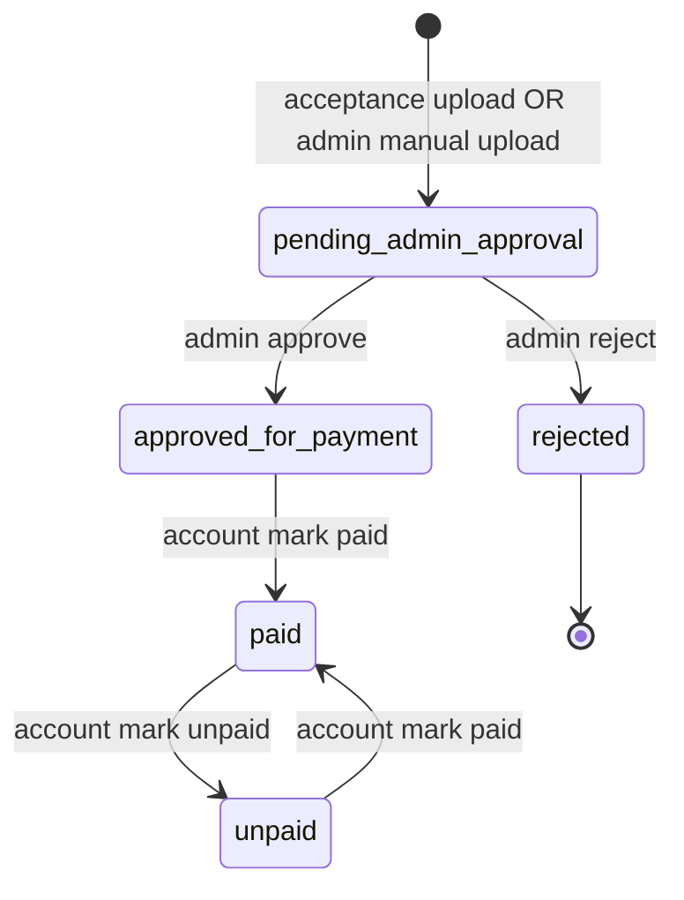

# Vendor & freight carrier payables — flow & API

**Date:** 2026-09-24  
**Scope:** Accounts-payable invoices (`invoiceType: vendor | freight_carrier`) with admin approval, account payment, acceptance-email upload, and admin ↔ account comments.

Base URL: `/api` (JWT unless noted **Public**).

---

## 1. Lifecycle



| `payableWorkflow.status` | Meaning | Typical UI |
|--------------------------|---------|------------|
| `pending_admin_approval` | Submitted, waiting for admin | Approve / Reject |
| `approved_for_payment` | Admin approved; account may pay | Payment **Pending** |
| `rejected` | Admin rejected | — |
| `paid` | Account marked paid | Payment **Completed** |
| `unpaid` | Reopened after paid, or ready to pay (same queue as approved) | Payment **Pending** |

**Sources (`payableWorkflow.source`):**

| Value | How created |
|--------|-------------|
| `acceptance_upload` | Vendor/carrier uploads PDF after award email |
| `admin_manual` | Admin **Upload Invoice** form |

Legacy seed rows without `payableWorkflow` still appear on admin lists; `payableStatus` is derived from top-level `status`.

---

## 2. End-to-end flow

### A — Acceptance email (vendor shipper approve)

1. Plant approves shipper → `POST /api/plant/shipper-requests/:requestId/approve` (or admin plant mirror).
2. Backend sets `ShipperRequest.payableUploadToken` and emails vendor with link:  
   `{CLIENT_URL}/payable-invoice-upload/{token}` (FE public page).
3. Vendor (no JWT):
   - `GET /api/public/payable-invoice-upload/:token` — bootstrap
   - `POST .../presigned-url` — S3 upload
   - `POST .../token` — create payable invoice
4. Creates `Invoice` (`invoiceType: vendor`, `payableWorkflow.status: pending_admin_approval`).
5. Admin approves → account queue → account marks paid.

### B — Acceptance email (freight bid awarded)

Same as A, triggered by `POST /api/plant/freight-bids/:bidId/select` (token on `FreightBid.payableUploadToken`), `invoiceType: freight_carrier`.

### C — Admin manual upload

1. `POST /api/admin/invoices/payables/vendor` or `.../freight-carrier` with project, payee, amount, PDF URL.
2. Status `pending_admin_approval` (another admin approves in queue).
3. After approve → account panel.

### D — Admin ↔ account comments

Either role posts comments on the same invoice; both see full thread on detail GET.

---

## 3. Public (acceptance upload)

| Step | Method | Path |
|------|--------|------|
| Page bootstrap | GET | `/api/public/payable-invoice-upload/:token` |
| Presign | POST | `/api/public/payable-invoice-upload/:token/presigned-url` |
| Submit invoice | POST | `/api/public/payable-invoice-upload/:token` |

**Submit body:**

```json
{
  "documentUrl": "https://.../payable-invoices/...pdf",
  "documentFileName": "invoice.pdf",
  "totalAmount": 45000,
  "description": "Optional note",
  "vendorInvoiceNumber": "Their INV-123",
  "daysToPay": 30
}
```

**Bootstrap response (example):**

```json
{
  "invoiceType": "vendor",
  "projectName": "Dev Warehouse One",
  "jobId": "PRO-005",
  "payeeName": "React6",
  "suggestedAmount": 42000,
  "alreadySubmitted": false
}
```

One invoice per approval token (`alreadySubmitted: true` if resubmit attempted).

---

## 4. Admin APIs

Auth: **admin** (`Authorization: Bearer`).

| Action | Method | Path |
|--------|--------|------|
| Filter enums | GET | `/api/admin/invoices/payables/filters` |
| Approval queue (default pending) | GET | `/api/admin/invoices/payables/approval-queue?invoiceType=vendor&page=1&limit=20` |
| Manual vendor payable | POST | `/api/admin/invoices/payables/vendor` |
| Manual freight payable | POST | `/api/admin/invoices/payables/freight-carrier` |
| Detail + comments | GET | `/api/admin/invoices/payables/:invoiceId` |
| Approve | PUT | `/api/admin/invoices/payables/:invoiceId/approve` |
| Reject | PUT | `/api/admin/invoices/payables/:invoiceId/reject` |
| Comment | POST | `/api/admin/invoices/payables/:invoiceId/comments` |

**Manual create body (vendor):**

```json
{
  "leadId": "<mongoId>",
  "vendorId": "<mongoId>",
  "totalAmount": 12000,
  "category": "service",
  "description": "Steel materials",
  "date": "2026-09-24",
  "daysToPay": 30,
  "documentUrl": "https://.../file.pdf",
  "documentFileName": "file.pdf"
}
```

**Reject body:** `{ "reason": "Amount does not match PO" }`

**Comment body:** `{ "text": "Please confirm W-9" }`

### Existing list screens (unchanced paths, richer rows)

| List | GET |
|------|-----|
| Vendor invoices | `/api/admin/invoices/vendor?status=All&payableStatus=approved_for_payment&projectId=&startDate=&endDate=&search=` |
| Freight carrier | `/api/admin/invoices/freight-carrier` (same query params) |
| Export | `/api/admin/invoices/vendor/export`, `.../freight-carrier/export` |

List items now include **`payableStatus`**, **`paymentLabel`**, **`documentUrl`** (via `buildPayableListRow`).

Optional query **`payableStatus`**: `pending_admin_approval` | `approved_for_payment` | `rejected` | `paid` | `unpaid`.

Legacy **`status`** filter still works for old rows without `payableWorkflow`.

---

## 5. Account APIs

Auth: **account** or **admin**.

| Action | Method | Path |
|--------|--------|------|
| Filter enums | GET | `/api/account/payables/filters` |
| Payment queue + stats | GET | `/api/account/payables?invoiceType=vendor&payableStatus=&page=1&limit=20` |
| Detail + comments | GET | `/api/account/payables/:invoiceId` |
| Mark paid | PUT | `/api/account/payables/:invoiceId/mark-paid` |
| Mark unpaid | PUT | `/api/account/payables/:invoiceId/mark-unpaid` |
| Comment | POST | `/api/account/payables/:invoiceId/comments` |

Default list: `payableWorkflow.status` in **`approved_for_payment`**, **`paid`**, **`unpaid`**.

**Mark paid body (optional):** `{ "paymentMethod": "bank_transfer" }`

**List stats object:**

```json
{
  "pendingPayment": 3,
  "pendingAmount": 67500,
  "paid": 10,
  "paidAmount": 240000,
  "unpaid": 1,
  "unpaidAmount": 5000
}
```

---

## 6. Data model (Invoice)

Payables use the same **`Invoice`** collection:

| Field | Notes |
|--------|--------|
| `invoiceType` | `vendor` \| `freight_carrier` |
| `vendorId` / `carrierId` | Payee |
| `leadId` | Project |
| `totalAmount`, `dueDate`, `category` | Display / export |
| `payableWorkflow.status` | AP lifecycle |
| `payableWorkflow.source` | `acceptance_upload` \| `admin_manual` |
| `payableWorkflow.documentUrl` | Uploaded PDF |
| `payableWorkflow.shipperRequestId` / `freightBidId` | Source link |
| `payableWorkflow.comments[]` | `{ text, authorRole, authorId, createdAt }` |

Invoice numbers: **`VINV-{year}-{seq}`** (vendor), **`FINV-{year}-{seq}`** (freight).

---

## 7. Frontend checklist

### Acceptance upload page (`/payable-invoice-upload/:token`)

- [ ] GET bootstrap → show project, suggested amount, disable if `alreadySubmitted`
- [ ] Presign → PUT file to S3 → POST submit with `documentUrl` + `totalAmount`

### Admin

- [ ] Upload Invoice → POST payables vendor/freight-carrier
- [ ] Approval queue tab → GET `.../payables/approval-queue`
- [ ] Approve / Reject on pending rows
- [ ] Vendor/Freight lists → use `payableStatus` + `paymentLabel`; filter `payableStatus`
- [ ] Comment thread on detail

### Account

- [ ] Payables queue → GET `/api/account/payables`
- [ ] Mark paid / unpaid
- [ ] Comments

### Plant

- [ ] No invoice create UI required; shipper approve + freight select trigger email links automatically

---

## 8. Relation to old account “vendor invoices” tab

`GET /api/account/financial/invoices/vendor` still reads **`PaymentApproval`** (legacy). New work should use **`/api/account/payables`** tied to **`Invoice`**. Migrate UI when ready.

---

## 9. Plant triggers (reference)

| Event | API | Side effect |
|--------|-----|-------------|
| Vendor quote approved | `POST /api/plant/shipper-requests/:requestId/approve` | `payableUploadToken` + email link |
| Freight bid selected | `POST /api/plant/freight-bids/:bidId/select` | `payableUploadToken` + email link |

Admin plant routes mirror the same plant controllers under `/api/admin/plant/...`.
